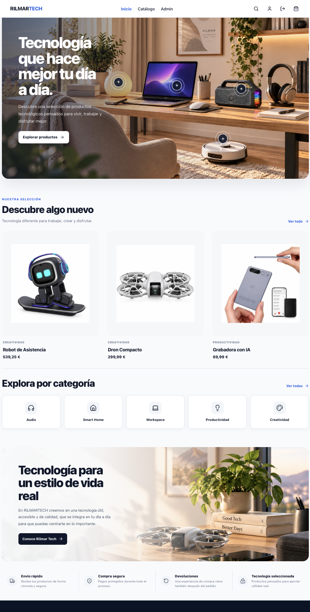
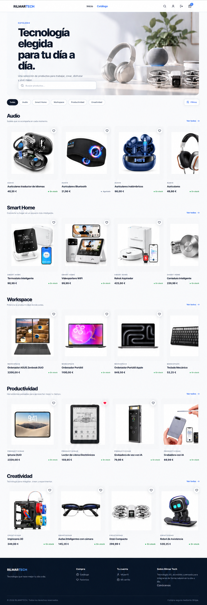
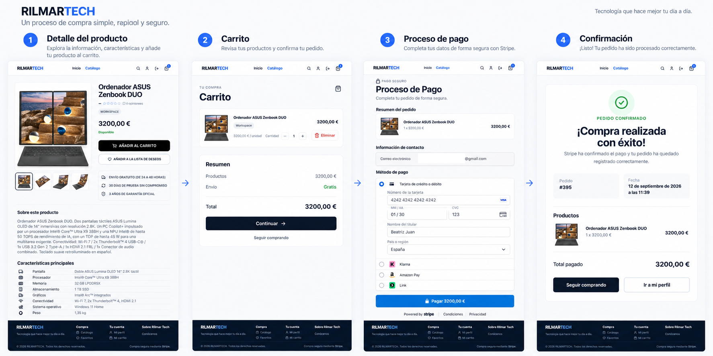
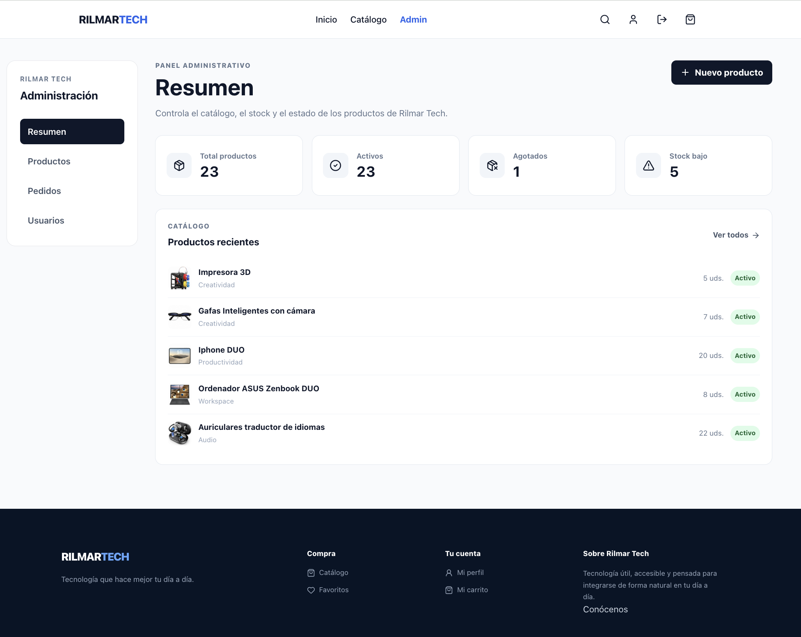

# Rilmar Tech — Frontend

Frontend de una aplicación **full-stack de comercio electrónico** orientada a productos tecnológicos.

React 19 · Redux Toolkit · React Router · Axios · CSS Modules · Vite · Stripe

[Demo](https://aesthetic-halva-6e8e80.netlify.app) ·
[Backend API](https://backend-modulo2-api.onrender.com) ·
[Swagger](https://backend-modulo2-api.onrender.com/api/docs) ·
[Repositorio Backend](https://github.com/J-Mateo/modulo2)

---

## Vista general

Rilmar Tech ofrece una experiencia completa de ecommerce: catálogo, búsqueda y filtros, detalle de producto, carrito de invitado, autenticación, wishlist, checkout con Stripe, historial de pedidos y administración protegida por rol.

El frontend consume una API REST independiente y mantiene separadas la interfaz, el estado global y la comunicación HTTP.

### Stack principal

| Área | Tecnologías |
|---|---|
| UI | React 19 |
| Routing | React Router |
| Estado global | Redux Toolkit, React Redux |
| HTTP | Axios |
| Estilos | CSS Modules |
| Iconografía | Lucide React |
| Build | Vite |
| Calidad | ESLint |
| Deploy | Netlify |

---

## Home

La página principal presenta el catálogo mediante una experiencia editorial orientada a producto.



Incluye hero principal, hotspots interactivos, selección destacada, categorías, bloques editoriales, elementos de confianza y navegación responsive.

---

## Catálogo

El catálogo permite navegar y descubrir productos mediante búsqueda, categorías y filtros.



Principales capacidades:

- Búsqueda insensible a acentos
- Categorías
- Filtros por disponibilidad y precio
- Ordenación
- Paginación
- Estados de stock
- Acceso al detalle
- Acciones de carrito
- Wishlist para usuarios autenticados

En móvil, las categorías utilizan navegación horizontal y los filtros se adaptan a pantallas pequeñas.

---

## Experiencia de compra

Rilmar Tech permite completar el proceso desde la selección de un producto hasta la confirmación del pedido.



```text
Producto
   │
   ▼
Carrito
   │
   ▼
Checkout
   │
   ▼
Stripe Checkout
   │
   ▼
Webhook
   │
   ▼
Pedido confirmado
```

El detalle de producto incluye galería, descripción, precio, disponibilidad, reviews, carrito y wishlist.

El carrito puede utilizarse sin iniciar sesión. La autenticación pasa a ser necesaria al continuar hacia checkout.

---

## Autenticación

La sesión utiliza un JWT gestionado por el backend mediante **cookie HTTP-Only**. El token no se almacena en `localStorage`.

La aplicación implementa:

- Registro
- Login y logout
- Persistencia de sesión
- Rutas protegidas
- Rutas exclusivas para invitados
- Protección por rol `ADMIN`
- Recuperación y restablecimiento de contraseña
- Invalidación de sesiones anteriores tras cambiar la contraseña

Axios utiliza credenciales en las peticiones autenticadas para permitir el intercambio de la cookie entre frontend y backend.

### Recuperación de contraseña

La nueva contraseña debe cumplir:

- 8 caracteres como mínimo
- Una minúscula
- Una mayúscula
- Un número
- Un carácter especial

Después del restablecimiento, las sesiones anteriores quedan invalidadas y el usuario debe autenticarse de nuevo.

---

## Carrito

La aplicación soporta carrito para invitados y usuarios autenticados.

### Invitado

Un visitante puede añadir, eliminar y modificar productos, acceder a `/cart` y recargar la aplicación sin perder el carrito.

El almacenamiento local contiene únicamente:

```text
productId
quantity
```

No se guardan precios, stock, tokens, datos personales ni información de sesión.

### Sincronización tras autenticación

Después de login o registro, el carrito de invitado se sincroniza con el backend.

```text
Guest cart
    │
    ▼
Login / Register
    │
    ▼
Sincronización
    │
    ▼
Backend valida producto, stock y precio
    │
    ▼
Carrito autenticado
```

Cada item local se elimina únicamente después de una sincronización correcta. Los datos comerciales definitivos siempre son validados por el backend.

---

## Wishlist

La wishlist requiere autenticación, forma parte del estado global de Redux Toolkit y se sincroniza con el backend para persistir entre sesiones.

---

## Checkout y Stripe

El checkout requiere autenticación.

El frontend solicita al backend la preparación del pedido. El servidor valida productos, stock y precios, reserva inventario, crea el pedido y genera la Stripe Checkout Session.

El frontend recibe únicamente:

```text
orderId
checkoutUrl
```

y redirige al usuario a Stripe.

```text
Frontend
   │
   ▼
Backend
   ├── valida carrito
   ├── valida precios y stock
   ├── reserva stock
   ├── crea Order PENDING
   └── crea Stripe Checkout Session
             │
             ▼
           Stripe
             │
             ▼
           Webhook
             │
             ▼
      PAID / CANCELLED
```

Los datos sensibles de tarjeta se introducen directamente en Stripe Checkout.

### Confirmación de pago

La página de éxito **no modifica el estado del pedido**.

Después de regresar desde Stripe, el frontend consulta al backend utilizando el identificador de sesión.

```text
Stripe redirect
      │
      ▼
CheckoutSuccessPage
      │
      ▼
Consulta al backend
      │
      ▼
PENDING / PAID / CANCELLED
```

El webhook del backend es la fuente de verdad para la confirmación del pago.

---

## Historial de pedidos

Los usuarios autenticados pueden consultar sus pedidos desde el perfil.

La interfaz muestra:

- Número de pedido
- Fecha
- Total
- Estado
- Productos
- Cantidades
- Precio histórico

Los datos comerciales proceden de snapshots almacenados por el backend durante la compra.

---

## Panel de administración

El frontend dispone de un área protegida para usuarios `ADMIN`.



```text
Administración
├── Resumen
├── Productos
├── Pedidos
└── Usuarios
```

### Productos

Permite buscar, filtrar, crear y editar productos, gestionar stock e imágenes, y desactivar o restaurar productos.

### Pedidos

Vista administrativa de solo lectura con búsqueda, filtro por estado, paginación e información comercial.

### Usuarios

Vista administrativa de solo lectura con búsqueda, filtro por rol y paginación.

La protección visual del frontend no sustituye a la autorización: el backend vuelve a comprobar el rol `ADMIN`.

---

## Diseño responsive

La interfaz está diseñada para escritorio y móvil.

Entre las decisiones de UX se incluyen:

- Navegación responsive
- Hero adaptativo
- Carruseles horizontales en móvil
- Filtros adaptados a pantallas pequeñas
- Cards responsive
- Galería de producto adaptativa
- CTA flotante en detalle
- Estados de carga, vacío y error
- Reintentos cuando corresponde
- Feedback de acciones
- Preservación de navegación durante autenticación
- Carrito accesible sin sesión

---

## Arquitectura frontend

```text
src/
├── api/
├── assets/
├── components/
│   ├── app/
│   ├── cart/
│   ├── catalog/
│   ├── common/
│   ├── home/
│   ├── layout/
│   ├── product/
│   └── reviews/
├── data/
├── hooks/
├── pages/
├── router/
├── store/
├── styles/
├── utils/
├── App.jsx
└── main.jsx
```

La organización separa responsabilidades:

| Directorio | Responsabilidad |
|---|---|
| `api/` | Comunicación HTTP con el backend |
| `components/` | UI reutilizable agrupada por dominio |
| `pages/` | Composición de vistas asociadas a rutas |
| `router/` | Routing, lazy loading y protección de rutas |
| `store/` | Estado global y thunks |
| `hooks/` | Lógica reutilizable de React |
| `data/` | Datos estáticos de interfaz |
| `utils/` | Utilidades independientes de presentación |
| `styles/` | Estilos globales |
| `assets/` | Recursos visuales |

### Estado global

Redux Toolkit gestiona principalmente:

```text
Auth
Cart
Wishlist
```

El estado local de formularios, filtros e interacción permanece en React cuando no necesita compartirse globalmente.

### Comunicación HTTP

Axios centraliza la comunicación con la API mediante `src/api/`.

```env
VITE_API_URL=http://localhost:3000/api
```

En producción:

```env
VITE_API_URL=https://backend-modulo2-api.onrender.com/api
```

---

## Routing

React Router divide las rutas en públicas, exclusivas para invitados, autenticadas y administrativas.

| Ruta | Acceso | Descripción |
|---|---|---|
| `/` | Pública | Home |
| `/about` | Pública | Información de Rilmar Tech |
| `/products` | Pública | Catálogo |
| `/products/:id` | Pública | Detalle de producto |
| `/cart` | Pública | Carrito |
| `/login` | Invitado | Inicio de sesión |
| `/register` | Invitado | Registro |
| `/forgot-password` | Invitado | Recuperación de contraseña |
| `/reset-password` | Invitado | Nueva contraseña |
| `/wishlist` | Usuario | Wishlist |
| `/profile` | Usuario | Perfil e historial |
| `/checkout` | Usuario | Checkout |
| `/checkout/success` | Usuario | Confirmación |
| `/admin` | ADMIN | Dashboard |
| `/admin/products` | ADMIN | Gestión de productos |
| `/admin/products/new` | ADMIN | Nuevo producto |
| `/admin/products/:id/edit` | ADMIN | Editar producto |
| `/admin/orders` | ADMIN | Pedidos |
| `/admin/users` | ADMIN | Usuarios |

Las rutas desconocidas muestran `NotFound`.

Netlify utiliza `public/_redirects` para aplicar el fallback SPA y permitir recarga o acceso directo a rutas de React Router.

```text
/*    /index.html   200
```

---

## Code splitting

Las páginas secundarias utilizan `React.lazy` y `Suspense`.

La Home permanece disponible directamente mientras el resto de páginas puede cargarse mediante chunks bajo demanda, reduciendo el JavaScript inicial.

---

## Seguridad

El frontend evita asumir responsabilidades que pertenecen al servidor:

- El JWT no se almacena en `localStorage`
- La sesión utiliza cookie HTTP-Only
- Los datos del carrito local se consideran no confiables
- Precio y stock definitivos se validan en backend
- La autorización administrativa definitiva se realiza en backend
- Stripe Checkout Session se crea en el servidor
- El frontend no procesa datos sensibles de tarjeta
- La confirmación del pago depende del estado del backend
- No se almacenan secretos en variables `VITE_*`

> Las variables `VITE_*` son accesibles desde el navegador y nunca deben contener secretos.

---

## Instalación

### 1. Clonar

```bash
git clone https://github.com/J-Mateo/rilmar-tech-frontend.git
cd rilmar-tech-frontend
```

### 2. Instalar dependencias

```bash
npm install
```

### 3. Configurar entorno

Crea `.env` a partir de `.env.example`:

```env
VITE_API_URL=http://localhost:3000/api
```

### 4. Desarrollo

```bash
npm run dev
```

### 5. Build

```bash
npm run lint
npm run build
```

---

## Scripts

| Comando | Descripción |
|---|---|
| `npm run dev` | Inicia Vite en desarrollo |
| `npm run build` | Genera el build de producción |
| `npm run lint` | Ejecuta ESLint |
| `npm run preview` | Sirve localmente el build |

---

## Despliegue

### Frontend

**Netlify**

https://aesthetic-halva-6e8e80.netlify.app

Los pushes a `main` generan nuevos deployments automáticamente.

### Backend

**Render**

https://backend-modulo2-api.onrender.com

La comunicación entre ambos despliegues utiliza HTTPS, CORS con credenciales y cookies HTTP-Only configuradas por el backend.

---

## Estado del proyecto

- ✅ Home y catálogo responsive
- ✅ Búsqueda insensible a acentos
- ✅ Filtros, ordenación y paginación
- ✅ Detalle y galería de producto
- ✅ Reviews
- ✅ Registro, login y logout
- ✅ Persistencia de sesión
- ✅ Recuperación de contraseña
- ✅ Perfil e historial de pedidos
- ✅ Wishlist
- ✅ Carrito de invitado
- ✅ Sincronización de carrito
- ✅ Carrito autenticado persistente
- ✅ Stripe Checkout
- ✅ Confirmación de pago mediante backend
- ✅ Panel administrativo
- ✅ CRUD de productos
- ✅ Gestión de imágenes
- ✅ Consulta administrativa de pedidos
- ✅ Consulta administrativa de usuarios
- ✅ Protección de rutas y roles
- ✅ Lazy loading y code splitting
- ✅ Routing SPA en producción
- ✅ Frontend desplegado en Netlify
- ✅ Backend desplegado en Render
- ✅ Integración frontend/backend verificada en producción

---

## Repositorios

- **Frontend:** https://github.com/J-Mateo/rilmar-tech-frontend
- **Backend:** https://github.com/J-Mateo/modulo2

---

## Autora

**Jessica Mateo**

Proyecto desarrollado individualmente como aplicación full-stack de comercio electrónico.

El desarrollo se ha centrado especialmente en experiencia de usuario, diseño responsive, arquitectura frontend, separación de responsabilidades, gestión de estado, integración frontend/backend, autenticación, seguridad del flujo de compra, Stripe, administración, calidad de código y despliegue.
