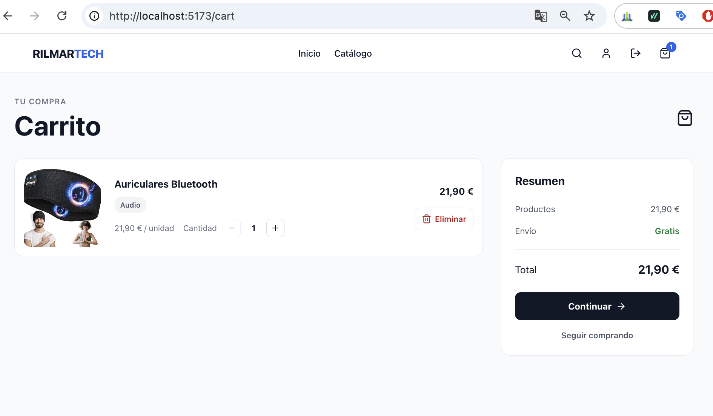
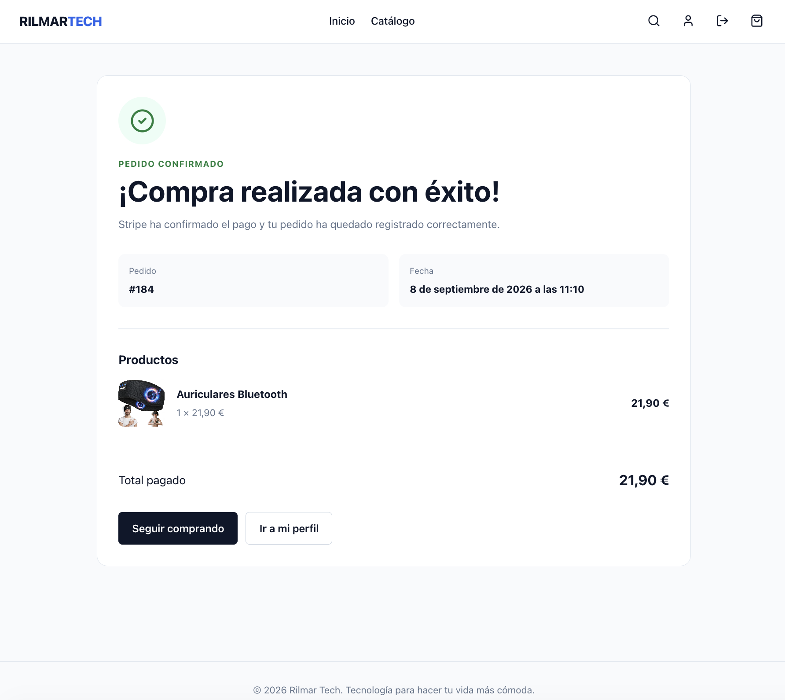

# Rilmar Tech — Frontend

Frontend de **Rilmar Tech**, una aplicación full-stack de comercio electrónico orientada a la venta de productos tecnológicos.

La aplicación ofrece una experiencia completa de compra: catálogo, búsqueda y filtros, detalle de producto, carrito para invitados y usuarios autenticados, wishlist, checkout con Stripe, historial de pedidos y un panel de administración protegido por roles.

El frontend está desarrollado con **React, Redux Toolkit, React Router, Axios, CSS Modules y Vite**, y consume una API REST independiente desarrollada con Node.js, Express, Prisma, PostgreSQL y MongoDB.

---

## Vista previa

### Home


La página principal combina presentación de marca, productos destacados, navegación por categorías y contenido editorial en una interfaz responsive.

### Catálogo


El catálogo permite explorar productos por categorías y utilizar búsqueda, filtros de disponibilidad y precio, además de diferentes criterios de ordenación.

### Detalle de producto


La ficha de producto incluye galería de imágenes, información comercial, disponibilidad, acciones de compra, wishlist, descripción y reseñas.

### Carrito



El carrito permite modificar cantidades, eliminar productos y continuar hacia checkout. También puede utilizarse antes de iniciar sesión.

### Pedido confirmado



Tras completar el pago, la aplicación consulta el estado real del pedido en el backend antes de mostrar la confirmación de compra.

### Administración


El área administrativa centraliza la gestión de productos y permite consultar pedidos y usuarios mediante rutas protegidas para el rol `ADMIN`.

---

# Funcionalidades

## Experiencia de compra

- Home responsive
- Catálogo público
- Navegación por categorías
- Búsqueda de productos
- Búsqueda insensible a acentos
- Filtros por categoría
- Filtros por precio
- Filtros por disponibilidad
- Ordenación de productos
- Paginación
- Detalle de producto
- Galería con múltiples imágenes
- Información de stock
- Reviews
- Wishlist
- Carrito para invitados
- Carrito persistente para usuarios
- Checkout
- Stripe Checkout
- Confirmación de pedido
- Historial de pedidos

---

# Autenticación

La aplicación dispone de:

- Registro
- Login
- Logout
- Persistencia de sesión
- Recuperación de contraseña
- Restablecimiento de contraseña
- Perfil de usuario
- Rutas protegidas
- Rutas exclusivas para administradores

La autenticación se realiza mediante un JWT gestionado por el backend dentro de una cookie **HTTP-Only**.

El frontend no almacena el JWT de autenticación en `localStorage`.

Las peticiones autenticadas se realizan con credenciales habilitadas mediante Axios.

---

# Recuperación de contraseña

El frontend implementa el flujo completo de recuperación de contraseña.

```text
Forgot password
       │
       ▼
Solicitud al backend
       │
       ▼
Email de recuperación
       │
       ▼
Enlace con token temporal
       │
       ▼
Reset password
       │
       ▼
Nueva contraseña
```

La interfaz aplica la misma política de contraseña utilizada por el backend para ofrecer feedback antes de enviar el formulario.

La seguridad definitiva del token, su expiración y su consumo se validan en la API.

---

# Carrito de invitado

Rilmar Tech permite utilizar el carrito antes de iniciar sesión.

Para un visitante, `localStorage` almacena únicamente:

```text
productId
quantity
```

No se almacenan localmente:

- Precios confiables
- Stock confiable
- Datos de pago
- JWT
- Cookies de autenticación
- Información personal

Los datos necesarios para representar cada producto se obtienen de la API pública y se mantienen en memoria.

Cuando el usuario inicia sesión o completa el registro, el carrito de invitado se sincroniza con el carrito persistente del backend.

```text
Guest cart
    │
    ▼
Login / Register
    │
    ▼
Sync productId + quantity
    │
    ▼
Backend validation
    │
    ▼
Authenticated cart
```

Durante la sincronización, el frontend envía únicamente el identificador del producto y la cantidad.

El backend continúa siendo la fuente de verdad para:

- Existencia del producto
- Estado del producto
- Precio
- Stock
- Total
- Pedido

Si una sincronización falla parcialmente, solo se eliminan del almacenamiento local los elementos que ya hayan sido sincronizados correctamente.

El cierre de sesión no copia el carrito autenticado al almacenamiento local del navegador.

---

# Wishlist

La wishlist requiere autenticación.

Los productos guardados se mantienen mediante el backend, por lo que la lista de deseos persiste entre sesiones mientras se utilice la misma cuenta.

---

# Checkout y Stripe

Rilmar Tech utiliza **Stripe Checkout** para procesar los pagos.

La sesión de Stripe se crea siempre en el backend.

El frontend no determina el importe definitivo de la compra ni crea sesiones de pago directamente.

Flujo:

```text
Cart
  │
  ▼
Backend checkout
  │
  ▼
Stock reservado
  │
  ▼
Order PENDING
  │
  ▼
Stripe Checkout Session
  │
  ▼
Frontend redirect
  │
  ▼
Stripe Checkout
  │
  ▼
Webhook verificado
  │
  ▼
PAID / CANCELLED
```

El backend responde al inicio del checkout con información equivalente a:

```json
{
  "orderId": 184,
  "checkoutUrl": "https://checkout.stripe.com/..."
}
```

El frontend utiliza `checkoutUrl` para redirigir al usuario a Stripe.

Los datos sensibles de la tarjeta se introducen directamente en la interfaz segura de Stripe y no pasan por formularios propios de Rilmar Tech.

---

# Confirmación del pago

La página de éxito no modifica el estado de un pedido.

Después de regresar desde Stripe, el frontend utiliza el identificador de la sesión para consultar al backend.

```text
Stripe redirect
      │
      ▼
CheckoutSuccessPage
      │
      ▼
Consulta al backend
      │
      ▼
PENDING / PAID / CANCELLED
```

Si el pedido continúa temporalmente en estado `PENDING`, la interfaz puede volver a consultar su estado durante un breve periodo.

La confirmación visual de la compra se muestra cuando el backend devuelve el estado correspondiente.

De esta forma, una URL de éxito visitada directamente no constituye una confirmación de pago.

---

# Historial de pedidos

Los usuarios autenticados pueden consultar sus pedidos desde el perfil.

La interfaz muestra información como:

- Número de pedido
- Fecha
- Total
- Estado
- Productos comprados
- Cantidades
- Precio histórico

Los datos comerciales proceden de snapshots almacenados por el backend durante la compra, por lo que el historial no depende de que el producto mantenga posteriormente el mismo nombre, imagen o precio.

---

# Panel de administración

El frontend dispone de un área protegida para usuarios con rol:

```text
ADMIN
```

La navegación administrativa está dividida en:

```text
Resumen
Productos
Pedidos
Usuarios
```

## Resumen

Dashboard con información general del catálogo y actividad reciente.

## Productos

Permite:

- Buscar productos
- Filtrar productos
- Crear productos
- Editar productos
- Gestionar stock
- Gestionar múltiples imágenes
- Desactivar productos
- Restaurar productos

## Pedidos

Vista administrativa de solo lectura con:

- Búsqueda
- Filtro por estado
- Paginación
- Información comercial relevante

## Usuarios

Vista administrativa de solo lectura con:

- Búsqueda
- Filtro por rol
- Paginación

La protección visual del frontend no sustituye a la autorización: el backend vuelve a comprobar el rol `ADMIN` en los endpoints administrativos.

---

# Diseño responsive

La interfaz está diseñada para funcionar tanto en escritorio como en dispositivos móviles.

Entre las decisiones de UX se incluyen:

- Navegación responsive
- Hero adaptativo
- Secciones de productos por categoría
- Carruseles horizontales en móvil
- Filtros adaptados a pantallas pequeñas
- Cards de producto responsive
- Galería de producto adaptativa
- CTA de compra flotante en detalle de producto
- Estados de carga
- Estados vacíos
- Estados de error
- Reintentos cuando corresponde
- Feedback de acciones
- Navegación preservada durante autenticación
- Carrito accesible sin sesión iniciada

---

# Arquitectura frontend

El frontend está organizado por responsabilidades y dominios de interfaz, separando comunicación con la API, estado global, componentes reutilizables, páginas, routing, hooks y utilidades.

```text
src/
├── api/
├── assets/
├── components/
│   ├── app/
│   ├── cart/
│   ├── catalog/
│   ├── common/
│   ├── home/
│   ├── layout/
│   ├── product/
│   └── reviews/
├── data/
├── hooks/
├── pages/
├── router/
├── store/
├── styles/
├── utils/
├── App.jsx
└── main.jsx
```

## API

`api/` centraliza la comunicación HTTP con el backend mediante Axios.

Las distintas áreas de la aplicación consumen esta capa en lugar de acoplar directamente la interfaz a las peticiones HTTP.

## Components

`components/` contiene componentes reutilizables agrupados por dominio:

- `app/` — componentes relacionados con la inicialización de la aplicación.
- `cart/` — interfaz reutilizable del carrito.
- `catalog/` — componentes del catálogo y cards de productos.
- `common/` — componentes compartidos entre distintas áreas.
- `home/` — componentes específicos de la página principal.
- `layout/` — estructura general, navegación y layout.
- `product/` — componentes relacionados con productos y su detalle.
- `reviews/` — interfaz de reseñas.

## Pages

`pages/` contiene las páginas asociadas a las rutas principales y compone los componentes necesarios para cada vista.

## Store

`store/` centraliza el estado global gestionado con Redux Toolkit.

Redux se utiliza principalmente para dominios globales como:

- Autenticación
- Carrito
- Wishlist

## Router

`router/` centraliza:

- Definición de rutas
- Lazy loading
- Rutas protegidas
- Rutas para invitados
- Protección por rol `ADMIN`
- Estados de carga durante navegación

## Hooks

`hooks/` contiene lógica reutilizable de React que puede compartirse entre componentes y páginas.

## Data

`data/` contiene datos estáticos y configuraciones de interfaz que no requieren estado global ni peticiones a la API.

## Utils

`utils/` contiene utilidades reutilizables, incluyendo lógica auxiliar independiente de la presentación.

## Styles

`styles/` contiene estilos compartidos a nivel global, mientras que los componentes y páginas mantienen sus estilos específicos mediante CSS Modules cuando corresponde.

## Assets

`assets/` centraliza recursos visuales utilizados por la aplicación.

---

# Estado global

Redux Toolkit gestiona el estado global de los dominios que necesitan compartirse entre distintas partes de la aplicación.

Principalmente:

```text
Auth
Cart
Wishlist
```

La aplicación utiliza thunks para coordinar las operaciones asíncronas con la API.

El estado estrictamente local de formularios, filtros e interacción de componentes se mantiene dentro de React cuando no necesita convertirse en estado global.

---

# Comunicación HTTP

La comunicación con el backend está centralizada en:

```text
src/api/
```

La aplicación utiliza Axios como cliente HTTP.

La URL base se obtiene de:

```text
VITE_API_URL
```

con un valor local por defecto equivalente a:

```text
http://localhost:3000/api
```

Las peticiones que requieren sesión utilizan credenciales para permitir el intercambio de la cookie HTTP-Only con el backend.

---

# Routing

React Router gestiona la navegación de la aplicación.

Las rutas se dividen en:

- Públicas
- Exclusivas para invitados
- Protegidas para usuarios autenticados
- Protegidas para administradores

La aplicación conserva también la ruta original durante determinados flujos de autenticación.

Por ejemplo:

```text
Checkout success
      │
      ▼
Sesión expirada
      │
      ▼
Login
      │
      ▼
Regreso a checkout success
```

Esto evita perder el contexto de navegación cuando una ruta protegida requiere volver a autenticar al usuario.

---

# Code splitting

Las páginas secundarias utilizan carga diferida mediante:

```text
React.lazy
Suspense
```

La Home permanece disponible directamente mientras que otras páginas se cargan mediante chunks bajo demanda.

Esto permite reducir el tamaño del JavaScript inicial necesario para comenzar a utilizar la aplicación.

---

# Stack

| Tecnología | Uso |
|---|---|
| React 19 | Interfaz de usuario |
| React Router | Routing |
| Redux Toolkit | Estado global |
| React Redux | Integración de Redux con React |
| Axios | Cliente HTTP |
| CSS Modules | Estilos encapsulados |
| Lucide React | Iconografía |
| Vite | Desarrollo y build |
| ESLint | Calidad de código |

---

# Rutas

| Ruta | Acceso | Descripción |
|---|---|---|
| `/` | Pública | Home |
| `/about` | Pública | Información de Rilmar Tech |
| `/products` | Pública | Catálogo |
| `/products/:id` | Pública | Detalle de producto |
| `/cart` | Pública | Carrito |
| `/login` | Invitado | Inicio de sesión |
| `/register` | Invitado | Registro |
| `/forgot-password` | Invitado | Recuperación de contraseña |
| `/reset-password` | Invitado | Nueva contraseña |
| `/wishlist` | Usuario | Wishlist |
| `/profile` | Usuario | Perfil e historial de pedidos |
| `/checkout` | Usuario | Checkout |
| `/checkout/success` | Usuario | Confirmación de compra |
| `/admin` | ADMIN | Dashboard |
| `/admin/products` | ADMIN | Gestión de productos |
| `/admin/products/new` | ADMIN | Nuevo producto |
| `/admin/products/:id/edit` | ADMIN | Editar producto |
| `/admin/orders` | ADMIN | Consulta de pedidos |
| `/admin/users` | ADMIN | Consulta de usuarios |

Las rutas desconocidas muestran la página `NotFound`.

---

# Variables de entorno

El frontend utiliza una variable de entorno para configurar la dirección del backend:

```env
VITE_API_URL=http://localhost:3000/api
```

El repositorio incluye:

```text
.env.example
```

como referencia de configuración.

Para desarrollo local se puede utilizar:

```text
.env
```

En producción, `VITE_API_URL` debe contener la URL pública de la API desplegada.

Ejemplo:

```env
VITE_API_URL=https://api.example.com/api
```

## Importante

Las variables cuyo nombre comienza por:

```text
VITE_
```

son accesibles desde el código ejecutado en el navegador.

Por tanto, **no deben utilizarse para almacenar secretos**.

Claves como las siguientes pertenecen exclusivamente al backend:

```text
JWT_SECRET
DATABASE_URL
STRIPE_SECRET_KEY
STRIPE_WEBHOOK_SECRET
CLOUDINARY_API_SECRET
RESEND_API_KEY
```

---

# Instalación

## 1. Clonar el repositorio

```bash
git clone https://github.com/J-Mateo/rilmar-tech-frontend.git
cd rilmar-tech-frontend
```

## 2. Instalar dependencias

```bash
npm install
```

## 3. Configurar entorno

Crear un archivo:

```text
.env
```

a partir de:

```text
.env.example
```

La configuración local actual requiere:

```env
VITE_API_URL=http://localhost:3000/api
```

## 4. Iniciar desarrollo

```bash
npm run dev
```

---

# Scripts

| Comando | Descripción |
|---|---|
| `npm run dev` | Inicia Vite en modo desarrollo |
| `npm run build` | Genera el build de producción |
| `npm run lint` | Ejecuta ESLint |
| `npm run preview` | Sirve localmente el build generado |

---

# Build de producción

Para generar la aplicación:

```bash
npm run build
```

Vite genera el resultado en:

```text
dist/
```

Antes de desplegar se recomienda ejecutar:

```bash
npm run lint
npm run build
```

---

# Seguridad

El frontend evita asumir responsabilidades que pertenecen al servidor.

## Autenticación

El JWT no se almacena en `localStorage`.

La sesión se mantiene mediante una cookie HTTP-Only gestionada por el backend.

## Carrito de invitado

El almacenamiento local contiene únicamente:

```text
productId
quantity
```

Estos valores se consideran datos no confiables y son validados nuevamente por el backend.

## Precios

El frontend muestra información comercial, pero no constituye la fuente de verdad para calcular el importe definitivo de una compra.

## Stock

La disponibilidad mostrada mejora la experiencia del usuario, pero el stock definitivo vuelve a validarse durante el checkout.

## Administración

La protección de rutas del frontend mejora la navegación y evita mostrar interfaces no autorizadas.

La autorización definitiva se realiza en backend.

## Stripe

La sesión de Stripe se crea en el servidor.

El frontend únicamente recibe la URL necesaria para redirigir al usuario.

## Datos de pago

Los datos sensibles de la tarjeta se introducen directamente en Stripe Checkout.

## Variables de entorno

No se almacenan secretos en variables `VITE_*`.

---

# Backend

La API de Rilmar Tech se encuentra en un repositorio independiente:

**Rilmar Tech Backend**

https://github.com/J-Mateo/modulo2

El backend está desarrollado con:

- Node.js
- Express
- PostgreSQL
- Prisma
- MongoDB Atlas
- Mongoose
- JWT
- Stripe
- Cloudinary
- Resend
- Jest
- Supertest

Frontend y backend constituyen conjuntamente la aplicación full-stack Rilmar Tech.

---

# Estado del proyecto

Actualmente están implementadas:

- ✅ Home responsive
- ✅ Catálogo público
- ✅ Navegación por categorías
- ✅ Búsqueda insensible a acentos
- ✅ Filtros
- ✅ Ordenación
- ✅ Paginación
- ✅ Detalle de producto
- ✅ Galería de imágenes
- ✅ Reviews
- ✅ Registro
- ✅ Login
- ✅ Logout
- ✅ Persistencia de sesión
- ✅ Recuperación de contraseña
- ✅ Reset de contraseña
- ✅ Perfil de usuario
- ✅ Wishlist
- ✅ Carrito de invitado
- ✅ Persistencia del carrito de invitado
- ✅ Sincronización del carrito tras autenticación
- ✅ Carrito persistente autenticado
- ✅ Stripe Checkout
- ✅ Confirmación del estado del pedido
- ✅ Historial de pedidos
- ✅ Panel administrativo
- ✅ CRUD administrativo de productos
- ✅ Gestión de imágenes
- ✅ Consulta administrativa de pedidos
- ✅ Consulta administrativa de usuarios
- ✅ Rutas protegidas
- ✅ Protección por rol
- ✅ Responsive desktop / mobile
- ✅ Lazy loading
- ✅ Code splitting
- ✅ Build de producción

---

# Capturas

Las capturas utilizadas en este README se encuentran dentro del propio repositorio:

```text
docs/screenshots/
├── home.png
├── catalog.png
├── product-detail.png
├── cart.png
├── order-success.png
└── admin-dashboard.png
```

Estas capturas documentan tanto la experiencia pública de compra como el área privada de administración.

---

# Repositorios

## Frontend

https://github.com/J-Mateo/rilmar-tech-frontend

## Backend

https://github.com/J-Mateo/modulo2

---

# Demo

Las URLs públicas se añadirán después de completar el despliegue de producción.

```text
Frontend: pendiente de despliegue
Backend:  pendiente de despliegue
```

---

# Autora

**Jessica Mateo**

Proyecto desarrollado individualmente como aplicación full-stack de comercio electrónico.

El desarrollo se ha centrado especialmente en:

- Experiencia de usuario
- Diseño responsive
- Arquitectura frontend
- Separación de responsabilidades
- Gestión de estado
- Integración frontend/backend
- Autenticación
- Seguridad del flujo de compra
- Integridad del carrito
- Pagos mediante Stripe
- Administración
- Calidad de código