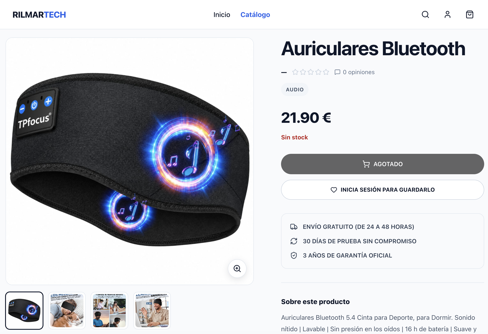

# Rilmar Tech — Frontend

Frontend de **Rilmar Tech**, una aplicación full-stack de comercio electrónico orientada a productos tecnológicos.

La aplicación está desarrollada con **React 19**, **Redux Toolkit**, **React Router**, **Axios**, **CSS Modules** y **Vite**, y consume una API REST independiente desarrollada con Node.js y Express.

El proyecto incluye catálogo público, autenticación mediante cookies HTTP-Only, carrito de invitado, sincronización de carrito, wishlist, recuperación de contraseña, Stripe Checkout, historial de pedidos y un panel administrativo protegido por rol.

---

# Demo

## Aplicación

https://rilmar-tech-frontend.vercel.app

## API

https://backend-modulo2-api.onrender.com

## Repositorio backend

https://github.com/J-Mateo/modulo2

---

# Experiencia de compra

Rilmar Tech permite completar un flujo de compra desde el catálogo hasta la confirmación del pedido.


El flujo incluye:

```text
Producto
   │
   ▼
Carrito
   │
   ▼
Checkout
   │
   ▼
Stripe Checkout
   │
   ▼
Webhook
   │
   ▼
Pedido confirmado
```

La sesión de Stripe se crea exclusivamente desde el backend. El frontend no calcula el importe definitivo ni modifica el estado del pedido.

---

# Home

La página principal presenta el catálogo mediante una experiencia editorial orientada a producto.


Incluye:

- Hero principal
- Hotspots interactivos
- Selección destacada de productos
- Categorías
- Bloques editoriales
- Elementos de confianza
- Navegación responsive

---

# Catálogo

El catálogo organiza los productos por categorías y permite navegar, buscar y filtrar el inventario.


Incluye:

- Búsqueda
- Búsqueda insensible a acentos
- Categorías
- Filtros
- Disponibilidad
- Rango de precios
- Ordenación
- Paginación
- Estados de stock
- Acceso al detalle de producto
- Acciones de carrito
- Wishlist para usuarios autenticados

En dispositivos móviles, las categorías utilizan carruseles horizontales y los filtros se adaptan a una interfaz específica para pantallas pequeñas.

---

# Detalle de producto

Cada producto dispone de una vista dedicada con información comercial, imágenes, disponibilidad y acciones de compra.



La página incluye:

- Imagen principal
- Galería
- Nombre
- Categoría
- Precio
- Stock
- Descripción
- Wishlist
- Añadir al carrito
- Reviews
- Información de garantía
- CTA de compra adaptado a móvil

El producto puede añadirse al carrito sin iniciar sesión.

---

# Autenticación

La autenticación utiliza un JWT gestionado mediante una **cookie HTTP-Only** creada por el backend.

El token no se almacena en `localStorage`.

La aplicación implementa:

- Registro
- Login
- Logout
- Persistencia de sesión
- Rutas protegidas
- Rutas exclusivas para invitados
- Protección por rol `ADMIN`
- Recuperación de contraseña
- Invalidación de sesiones anteriores después de restablecer la contraseña

Las peticiones autenticadas utilizan Axios con credenciales para permitir el intercambio de la cookie entre frontend y backend.

---

# Recuperación de contraseña

El usuario puede solicitar el restablecimiento de su contraseña desde la pantalla de login.

El frontend envía la solicitud al backend y muestra una respuesta genérica independientemente de si la cuenta existe.

El correo contiene un enlace hacia:

```text
/reset-password
```

con el token temporal correspondiente.

La nueva contraseña debe cumplir la política de seguridad definida por el backend:

- Mínimo 8 caracteres
- Una letra minúscula
- Una letra mayúscula
- Un número
- Un carácter especial

Después de restablecer la contraseña, las sesiones anteriores quedan invalidadas y el usuario debe iniciar sesión nuevamente.

---

# Carrito

La aplicación soporta carrito tanto para usuarios invitados como autenticados.

## Carrito de invitado

Un visitante puede:

- Añadir productos
- Eliminar productos
- Modificar cantidades
- Recargar la página sin perder el carrito
- Acceder a `/cart` sin iniciar sesión

El almacenamiento local contiene únicamente:

```text
productId
quantity
```

No se almacenan:

- Precios
- Nombres
- Imágenes
- Stock
- Tokens
- Datos personales
- Información de sesión

Los datos almacenados localmente se consideran no confiables.

## Sincronización después del login

Cuando un usuario inicia sesión o se registra, el carrito de invitado se sincroniza con el backend.

El frontend envía únicamente:

```text
productId
quantity
```

El backend vuelve a validar:

- Existencia del producto
- Estado
- Stock
- Precio

Cada producto se elimina del carrito local únicamente después de que su sincronización con el backend haya finalizado correctamente.

De esta forma, un fallo parcial de red no elimina los productos que todavía no han podido sincronizarse.

---

# Wishlist

Los usuarios autenticados pueden mantener una lista de productos favoritos.

La wishlist forma parte del estado global gestionado con Redux Toolkit y se sincroniza con el backend.

A diferencia del carrito, la wishlist requiere autenticación.

---

# Checkout

El checkout requiere una sesión autenticada.

Antes de iniciar el pago, el frontend solicita al backend la preparación del pedido.

El backend es responsable de:

- Validar el usuario
- Validar los productos
- Validar el stock
- Determinar los precios
- Calcular el total
- Crear el pedido
- Reservar stock
- Crear la Stripe Checkout Session

El frontend recibe:

```text
orderId
checkoutUrl
```

y redirige al usuario a Stripe Checkout.

---

# Stripe Checkout

Los datos sensibles de pago se introducen directamente en Stripe.

El frontend nunca recibe ni procesa números de tarjeta.

El flujo general es:

```text
Frontend
   │
   ▼
Backend
   │
   ├── valida carrito
   ├── reserva stock
   ├── crea Order PENDING
   └── crea Stripe Checkout Session
             │
             ▼
           Stripe
             │
             ▼
           Webhook
             │
             ▼
        PAID / CANCELLED
```

La página de éxito no modifica el estado del pedido.

El webhook del backend es la fuente de verdad para la confirmación del pago.

---

# Confirmación del pago

Después de regresar desde Stripe, el frontend utiliza el identificador de la sesión para consultar al backend.

```text
Stripe redirect
      │
      ▼
CheckoutSuccessPage
      │
      ▼
Consulta al backend
      │
      ▼
PENDING / PAID / CANCELLED
```

Si el pedido continúa temporalmente en estado `PENDING`, la interfaz puede volver a consultar su estado durante un breve periodo.

La confirmación visual de la compra se muestra cuando el backend devuelve el estado correspondiente.

De esta forma, una URL de éxito visitada directamente no constituye una confirmación de pago.

---

# Historial de pedidos

Los usuarios autenticados pueden consultar sus pedidos desde el perfil.

La interfaz muestra información como:

- Número de pedido
- Fecha
- Total
- Estado
- Productos comprados
- Cantidades
- Precio histórico

Los datos comerciales proceden de snapshots almacenados por el backend durante la compra, por lo que el historial no depende de que el producto mantenga posteriormente el mismo nombre, imagen o precio.

---

# Panel de administración

El frontend dispone de un área protegida para usuarios con rol:

```text
ADMIN
```


La navegación administrativa está dividida en:

```text
Resumen
Productos
Pedidos
Usuarios
```

## Resumen

Dashboard con información general del catálogo y actividad reciente.

## Productos

Permite:

- Buscar productos
- Filtrar productos
- Crear productos
- Editar productos
- Gestionar stock
- Gestionar múltiples imágenes
- Desactivar productos
- Restaurar productos

## Pedidos

Vista administrativa de solo lectura con:

- Búsqueda
- Filtro por estado
- Paginación
- Información comercial relevante

## Usuarios

Vista administrativa de solo lectura con:

- Búsqueda
- Filtro por rol
- Paginación

La protección visual del frontend no sustituye a la autorización: el backend vuelve a comprobar el rol `ADMIN` en los endpoints administrativos.

---

# Diseño responsive

La interfaz está diseñada para funcionar tanto en escritorio como en dispositivos móviles.

Entre las decisiones de UX se incluyen:

- Navegación responsive
- Hero adaptativo
- Secciones de productos por categoría
- Carruseles horizontales en móvil
- Filtros adaptados a pantallas pequeñas
- Cards de producto responsive
- Galería de producto adaptativa
- CTA de compra flotante en detalle de producto
- Estados de carga
- Estados vacíos
- Estados de error
- Reintentos cuando corresponde
- Feedback de acciones
- Navegación preservada durante autenticación
- Carrito accesible sin sesión iniciada

---

# Arquitectura frontend

El frontend está organizado por responsabilidades y dominios de interfaz, separando comunicación con la API, estado global, componentes reutilizables, páginas, routing, hooks y utilidades.

```text
src/
├── api/
├── assets/
├── components/
│   ├── app/
│   ├── cart/
│   ├── catalog/
│   ├── common/
│   ├── home/
│   ├── layout/
│   ├── product/
│   └── reviews/
├── data/
├── hooks/
├── pages/
├── router/
├── store/
├── styles/
├── utils/
├── App.jsx
└── main.jsx
```

## API

`api/` centraliza la comunicación HTTP con el backend mediante Axios.

Las distintas áreas de la aplicación consumen esta capa en lugar de acoplar directamente la interfaz a las peticiones HTTP.

## Components

`components/` contiene componentes reutilizables agrupados por dominio:

- `app/` — componentes relacionados con la inicialización de la aplicación.
- `cart/` — interfaz reutilizable del carrito.
- `catalog/` — componentes del catálogo y cards de productos.
- `common/` — componentes compartidos entre distintas áreas.
- `home/` — componentes específicos de la página principal.
- `layout/` — estructura general, navegación y layout.
- `product/` — componentes relacionados con productos y su detalle.
- `reviews/` — interfaz de reseñas.

## Pages

`pages/` contiene las páginas asociadas a las rutas principales y compone los componentes necesarios para cada vista.

## Store

`store/` centraliza el estado global gestionado con Redux Toolkit.

Redux se utiliza principalmente para dominios globales como:

- Autenticación
- Carrito
- Wishlist

## Router

`router/` centraliza:

- Definición de rutas
- Lazy loading
- Rutas protegidas
- Rutas para invitados
- Protección por rol `ADMIN`
- Estados de carga durante navegación

El despliegue en Vercel incluye un fallback SPA para permitir acceso directo y recarga en rutas gestionadas por React Router.

## Hooks

`hooks/` contiene lógica reutilizable de React que puede compartirse entre componentes y páginas.

## Data

`data/` contiene datos estáticos y configuraciones de interfaz que no requieren estado global ni peticiones a la API.

## Utils

`utils/` contiene utilidades reutilizables, incluyendo lógica auxiliar independiente de la presentación.

## Styles

`styles/` contiene estilos compartidos a nivel global, mientras que los componentes y páginas mantienen sus estilos específicos mediante CSS Modules cuando corresponde.

## Assets

`assets/` centraliza recursos visuales utilizados por la aplicación.

---

# Estado global

Redux Toolkit gestiona el estado global de los dominios que necesitan compartirse entre distintas partes de la aplicación.

Principalmente:

```text
Auth
Cart
Wishlist
```

La aplicación utiliza thunks para coordinar las operaciones asíncronas con la API.

El estado estrictamente local de formularios, filtros e interacción de componentes se mantiene dentro de React cuando no necesita convertirse en estado global.

---

# Comunicación HTTP

La comunicación con el backend está centralizada en:

```text
src/api/
```

La aplicación utiliza Axios como cliente HTTP.

La URL base se obtiene de:

```text
VITE_API_URL
```

con un valor local por defecto equivalente a:

```text
http://localhost:3000/api
```

Las peticiones que requieren sesión utilizan credenciales para permitir el intercambio de la cookie HTTP-Only con el backend.

En producción, el frontend consume:

```text
https://backend-modulo2-api.onrender.com/api
```

---

# Routing

React Router gestiona la navegación de la aplicación.

Las rutas se dividen en:

- Públicas
- Exclusivas para invitados
- Protegidas para usuarios autenticados
- Protegidas para administradores

La aplicación conserva también la ruta original durante determinados flujos de autenticación.

Por ejemplo:

```text
Checkout success
      │
      ▼
Sesión expirada
      │
      ▼
Login
      │
      ▼
Regreso a checkout success
```

Esto evita perder el contexto de navegación cuando una ruta protegida requiere volver a autenticar al usuario.

El despliegue de Vercel utiliza `vercel.json` para redirigir las rutas de la SPA hacia `index.html`, permitiendo recargar o abrir directamente rutas como `/products`, `/login` o `/profile`.

---

# Code splitting

Las páginas secundarias utilizan carga diferida mediante:

```text
React.lazy
Suspense
```

La Home permanece disponible directamente mientras que otras páginas se cargan mediante chunks bajo demanda.

Esto permite reducir el tamaño del JavaScript inicial necesario para comenzar a utilizar la aplicación.

---

# Stack

| Tecnología | Uso |
|---|---|
| React 19 | Interfaz de usuario |
| React Router | Routing |
| Redux Toolkit | Estado global |
| React Redux | Integración de Redux con React |
| Axios | Cliente HTTP |
| CSS Modules | Estilos encapsulados |
| Lucide React | Iconografía |
| Vite | Desarrollo y build |
| ESLint | Calidad de código |
| Vercel | Despliegue del frontend |

---

# Rutas

| Ruta | Acceso | Descripción |
|---|---|---|
| `/` | Pública | Home |
| `/about` | Pública | Información de Rilmar Tech |
| `/products` | Pública | Catálogo |
| `/products/:id` | Pública | Detalle de producto |
| `/cart` | Pública | Carrito |
| `/login` | Invitado | Inicio de sesión |
| `/register` | Invitado | Registro |
| `/forgot-password` | Invitado | Recuperación de contraseña |
| `/reset-password` | Invitado | Nueva contraseña |
| `/wishlist` | Usuario | Wishlist |
| `/profile` | Usuario | Perfil e historial de pedidos |
| `/checkout` | Usuario | Checkout |
| `/checkout/success` | Usuario | Confirmación de compra |
| `/admin` | ADMIN | Dashboard |
| `/admin/products` | ADMIN | Gestión de productos |
| `/admin/products/new` | ADMIN | Nuevo producto |
| `/admin/products/:id/edit` | ADMIN | Editar producto |
| `/admin/orders` | ADMIN | Consulta de pedidos |
| `/admin/users` | ADMIN | Consulta de usuarios |

Las rutas desconocidas muestran la página `NotFound`.

---

# Variables de entorno

El frontend utiliza una variable de entorno para configurar la dirección del backend:

```env
VITE_API_URL=http://localhost:3000/api
```

El repositorio incluye:

```text
.env.example
```

como referencia de configuración.

Para desarrollo local se puede utilizar:

```text
.env
```

En producción:

```env
VITE_API_URL=https://backend-modulo2-api.onrender.com/api
```

## Importante

Las variables cuyo nombre comienza por:

```text
VITE_
```

son accesibles desde el código ejecutado en el navegador.

Por tanto, **no deben utilizarse para almacenar secretos**.

Claves como las siguientes pertenecen exclusivamente al backend:

```text
JWT_SECRET
DATABASE_URL
STRIPE_SECRET_KEY
STRIPE_WEBHOOK_SECRET
CLOUDINARY_API_SECRET
RESEND_API_KEY
```

---

# Instalación

## 1. Clonar el repositorio

```bash
git clone https://github.com/J-Mateo/rilmar-tech-frontend.git
cd rilmar-tech-frontend
```

## 2. Instalar dependencias

```bash
npm install
```

## 3. Configurar entorno

Crear un archivo:

```text
.env
```

a partir de:

```text
.env.example
```

La configuración local requiere:

```env
VITE_API_URL=http://localhost:3000/api
```

## 4. Iniciar desarrollo

```bash
npm run dev
```

---

# Scripts

| Comando | Descripción |
|---|---|
| `npm run dev` | Inicia Vite en modo desarrollo |
| `npm run build` | Genera el build de producción |
| `npm run lint` | Ejecuta ESLint |
| `npm run preview` | Sirve localmente el build generado |

---

# Build de producción

Para generar la aplicación:

```bash
npm run build
```

Vite genera el resultado en:

```text
dist/
```

Antes de desplegar se recomienda ejecutar:

```bash
npm run lint
npm run build
```

El frontend está desplegado en **Vercel** y los pushes a la rama `main` generan nuevos deployments automáticamente.

---

# Seguridad

El frontend evita asumir responsabilidades que pertenecen al servidor.

## Autenticación

El JWT no se almacena en `localStorage`.

La sesión se mantiene mediante una cookie HTTP-Only gestionada por el backend.

En producción se utiliza HTTPS y las credenciales se intercambian con el backend mediante CORS configurado para el origen del frontend.

## Carrito de invitado

El almacenamiento local contiene únicamente:

```text
productId
quantity
```

Estos valores se consideran datos no confiables y son validados nuevamente por el backend.

## Precios

El frontend muestra información comercial, pero no constituye la fuente de verdad para calcular el importe definitivo de una compra.

## Stock

La disponibilidad mostrada mejora la experiencia del usuario, pero el stock definitivo vuelve a validarse durante el checkout.

## Administración

La protección de rutas del frontend mejora la navegación y evita mostrar interfaces no autorizadas.

La autorización definitiva se realiza en backend.

## Stripe

La sesión de Stripe se crea en el servidor.

El frontend únicamente recibe la URL necesaria para redirigir al usuario.

La confirmación definitiva del pago procede del estado gestionado por el backend a partir de los eventos de Stripe.

## Datos de pago

Los datos sensibles de la tarjeta se introducen directamente en Stripe Checkout.

## Variables de entorno

No se almacenan secretos en variables `VITE_*`.

---

# Backend

La API de Rilmar Tech se encuentra en un repositorio independiente:

**Rilmar Tech Backend**

https://github.com/J-Mateo/modulo2

**API desplegada**

https://backend-modulo2-api.onrender.com

El backend está desarrollado con:

- Node.js
- Express
- PostgreSQL
- Prisma
- MongoDB Atlas
- Mongoose
- JWT
- Stripe
- Cloudinary
- Resend
- Jest
- Supertest

Frontend y backend constituyen conjuntamente la aplicación full-stack Rilmar Tech.

---

# Despliegue

## Frontend

El frontend está desplegado en **Vercel**:

https://rilmar-tech-frontend.vercel.app

La configuración de producción utiliza:

```env
VITE_API_URL=https://backend-modulo2-api.onrender.com/api
```

Las rutas de React Router disponen de fallback SPA mediante `vercel.json`.

## Backend

El backend está desplegado en **Render**:

https://backend-modulo2-api.onrender.com

La comunicación entre ambos despliegues utiliza HTTPS, CORS con credenciales y cookies HTTP-Only configuradas por el backend.

---

# Estado del proyecto

Actualmente están implementadas y verificadas:

- ✅ Home responsive
- ✅ Catálogo público
- ✅ Navegación por categorías
- ✅ Búsqueda insensible a acentos
- ✅ Filtros
- ✅ Ordenación
- ✅ Paginación
- ✅ Detalle de producto
- ✅ Galería de imágenes
- ✅ Reviews
- ✅ Registro
- ✅ Login
- ✅ Logout
- ✅ Persistencia de sesión
- ✅ Recuperación de contraseña
- ✅ Reset de contraseña
- ✅ Perfil de usuario
- ✅ Wishlist
- ✅ Carrito de invitado
- ✅ Persistencia del carrito de invitado
- ✅ Sincronización del carrito tras autenticación
- ✅ Carrito persistente autenticado
- ✅ Stripe Checkout
- ✅ Webhook de Stripe desplegado
- ✅ Confirmación automática de pagos
- ✅ Confirmación del estado del pedido
- ✅ Historial de pedidos
- ✅ Panel administrativo
- ✅ CRUD administrativo de productos
- ✅ Gestión de imágenes
- ✅ Consulta administrativa de pedidos
- ✅ Consulta administrativa de usuarios
- ✅ Rutas protegidas
- ✅ Protección por rol
- ✅ Responsive desktop / mobile
- ✅ Lazy loading
- ✅ Code splitting
- ✅ Routing SPA en producción
- ✅ Build de producción
- ✅ Frontend desplegado en Vercel
- ✅ Backend desplegado en Render
- ✅ Integración frontend/backend verificada en producción

---

# Capturas

Las capturas utilizadas en este README se encuentran dentro del propio repositorio:

```text
docs/screenshots/
├── home.png
├── catalog.png
├── product-detail.png
├── checkout-flow.png
└── admin-dashboard.png
```

Las capturas documentan la Home, el catálogo, el detalle de producto, el flujo completo de compra y el área privada de administración.

---

# Repositorios

## Frontend

https://github.com/J-Mateo/rilmar-tech-frontend

## Backend

https://github.com/J-Mateo/modulo2

---

# Demo

## Aplicación

https://rilmar-tech-frontend.vercel.app

## API

https://backend-modulo2-api.onrender.com

---

# Autora

**Jessica Mateo**

Proyecto desarrollado individualmente como aplicación full-stack de comercio electrónico.

El desarrollo se ha centrado especialmente en:

- Experiencia de usuario
- Diseño responsive
- Arquitectura frontend
- Separación de responsabilidades
- Gestión de estado
- Integración frontend/backend
- Autenticación
- Seguridad del flujo de compra
- Integridad del carrito
- Pagos mediante Stripe
- Administración
- Calidad de código
- Despliegue y validación en producción